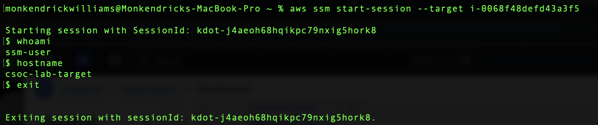
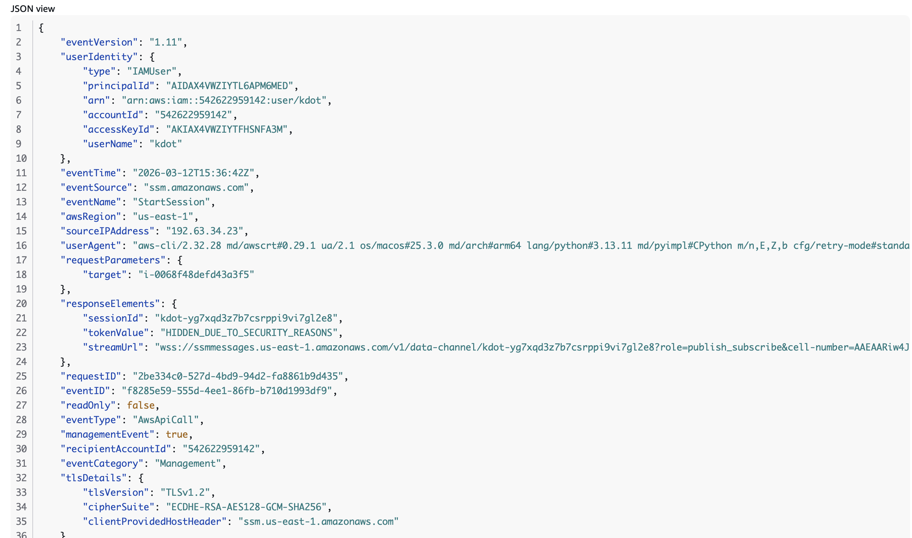

# Day 04 - Detecting AWS SSM Access via CloudTrail

## Objective

Simulate remote access to an EC2 instance using AWS Systems Manager Session Manager and then identify that activity within AWS CloudTrail logs.

The goal for this lab was to understand **what SSM access looks like from a detection standpoint** and which CloudTrail fields provide useful attribution for a SOC analyst.

---

## Attack Simulation

A session was initiated using the AWS CLI:

```bash
aws ssm start-session --target i-0068f48defd43a3f5
```


Figure 1: Interactive SSM session established on the target EC2 instance.

This established an interactive shell on the EC2 instance through **AWS Systems Manager Session Manager.**

Commands executed during the session:

```code
whoami
hostname
```

Output:
```code
ssm-user
csoc-lab-target
```

The presence of the `ssm-user` account confirms that access occurred through the **SSM agent**, rather than traditional SSH authentication.

This method allows administrators (or attackers with AWS credentials) to access instances **without opening SSH ports or generating standard authentication logs on the host**.

---

## Detection in CloudTrail

The activity was recorded in **AWS CloudTrail** as a management event.


Figure 2: CloudTrail StartSession event showing IAM user attribution and source IP.

Relevant event fields:

```code
eventSource: ssm.amazonaws.com
eventName: StartSession
userIdentity.userName: kdot
sourceIPAddress: 192.63.34.23
requestParameters.target: i-0068f48defd43a3f5
```

Key detection signals include:

- `eventName: StartSession`
- `eventSource: ssm.amazonaws.com`
- `userIdentity`
- `sourceIPAddress`

This demonstrates how **CloudTrail provides the primary audit trail for SSM activity**.

---

## Security Implication

Attackers may abuse AWS Systems Manager to access EC2 instances **without using SSH or exposing network ports**.

Because Session Manager operates through **AWS API calls**, traditional host-based authentication logs may not capture this activity.

For that reason, monitoring **CloudTrail for** `StartSession` **events** becomes critical for detecting unauthorized remote access.

---

## Detection Example (SIEM Logic)

Example detection query:

### Example Splunk Query

```spl
index=cloudtrail
eventSource="ssm.amazonaws.com"
eventName="StartSession"
```

SOC teams can enrich alerts by monitoring for:

- unexpected IAM users initiating sessions
- unusual source IP addresses
- sessions occurring outside business hours
- access to sensitive or production instances

---

## MITRE ATT&CK Mapping

```code
Technique: T1021–Remote Services
Sub-technique: T1021.007–Cloud Services (SSM)
```

---

## SOC Takeaway

SSM access can bypass traditional SSH monitoring entirely.

In cloud environments, **CloudTrail becomes the primary detection source for identifying remote administrative access to EC2 instances**.

Understanding how to interpret these events is essential for monitoring privileged access and detecting potential misuse of AWS Systems Manager.